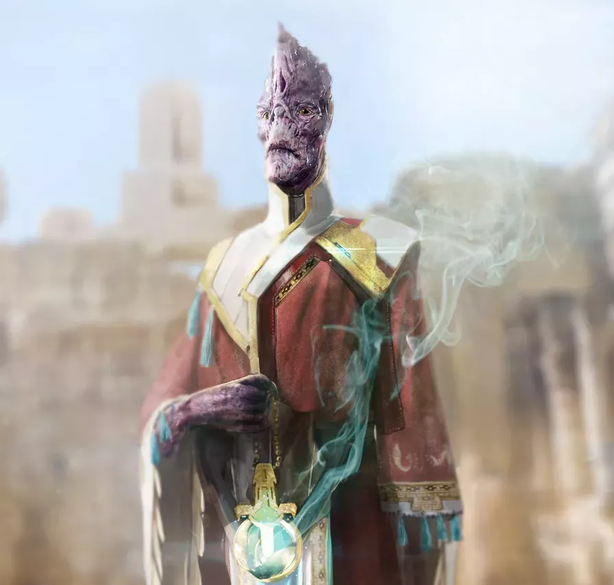

# Envoy
Merchants, entrepreneurs, actors, amdassadors, politicians, con artists, ship captains. All of the them have great charisma, the capacity to ispire, terrorize or deceive others, and a deep knowledge of people, their culture and their traditions.

Skilled manipulators and tacticians, where others succeed using weapons, they excel using only their words.

Playing an Envoy means being the tactician and the smooth talker of the group. A skilled envoy can remove himself and his party from almost danger without firing a single shot.

<strong>Stamina Points:</strong> 6 + Constitution Modifier

<strong>HP:</strong> 6

### Differences with Starfinder
Envoys in Starfinder are a bit of a do-it-all. They're good at social situations, but excel in fighting and technical feats too.   
In SC:RG Envoys are really good in every discipline that requires smooth-talking, but less adept in other fields.

## Key Ability Score

Your Charisma helps you succeed in many social situations and makes a number of your improvisations more effective, so Charisma is your key ability score.

A high Intelligence score improves all of your skills.

## Class Skills

<strong>Skills ranks per level:</strong> 8 + intelligence modifier

- Acrobatics (Dex)
- Athletics (Str)
- Bluff (Cha)
- Computers (Int)
- Culture (Int)
- Diplomacy (Cha)
- Disguise (Cha)
- Engineering (Int)
- Intimidate (Cha)
- Medicine (Int)
- Perception (Wis)
- Piloting (Dex)
- Profession (Cha, Int, or Wis)
- Sense Motive (Wis)
- Sleight of Hand (Dex)
- Stealth (Dex)

## Leveling
| Class Level | Base Attack Bonus | Fort Save Bonus | Ref Save Bonus | Will Save Bonus | Class Features |
|---|---|---|---|---|---|
| 1st | +0 | +0 | +2 | +2 | Envoy improvisation, Expertise (1d6), Skill expertise |
| 2nd | +1 | +0 | +3 | +3 | Envoy improvisation |
| 3rd | +2 | +1 | +3 | +3 | Expertise talent, Weapon specialization |
| 4th | +3 | +1 | +4 | +4 | Envoy improvisation |
| 5th | +3 | +1 | +4 | +4 | Expertise (1d6+1), Skill expertise |
| 6th | +4 | +2 | +5 | +5 | Envoy improvisation |
| 7th | +5 | +2 | +5 | +5 | Expertise talent |
| 8th | +6 | +2 | +6 | +6 | Envoy improvisation |
| 9th | +6 | +3 | +6 | +6 | Expertise (1d6+2), Skill expertise |
| 10th | +7 | +3 | +7 | +7 | Envoy improvisation |
| 11th | +8 | +3 | +7 | +7 | Expertise talent |
| 12th | +9 | +4 | +8 | +8 | Envoy improvisation |
| 13th | +9 | +4 | +8 | +8 | Expertise (1d8+2), Skill expertise |
| 14th | +10 | +4 | +9 | +9 | Envoy improvisation |
| 15th | +11 | +5 | +9 | +9 | Expertise talent |
| 16th | +12 | +5 | +10 | +10 | Envoy improvisation |
| 17th | +12 | +5 | +10 | +10 | Expertise (1d8+3), Skill expertise |
| 18th | +13 | +6 | +11 | +11 | Envoy improvisation |
| 19th | +14 | +6 | +11 | +11 | Expertise talent |
| 20th | +15 | +6 | +12 | +12 | Envoy improvisation, Expertise (1d8+4), True expertise |